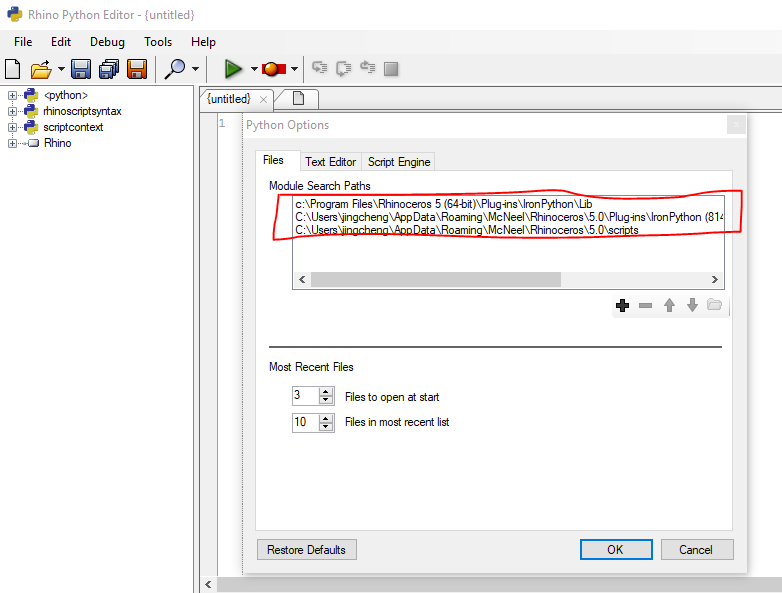
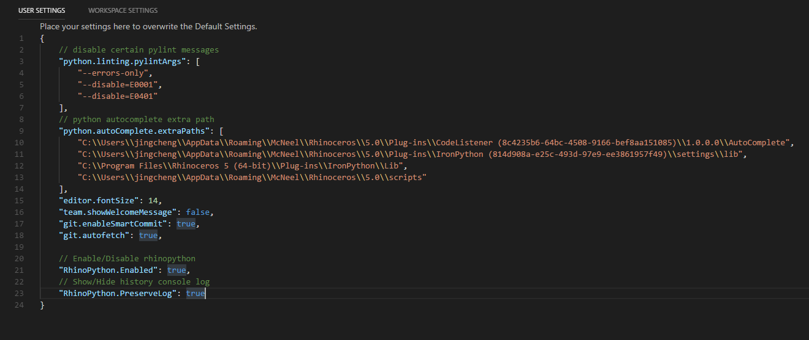

# RhinoPython

RhinoPython is a plugin to allow you to code Rhino python script in VS Code editor and run it in Rhino runtime. It inherits all the autocomplete intelligence from original rhinopython editor and can react faster, while you can benifit all the amazing advatanges that VS Code brings to you.

It is a **[DesignToProduction](http://designtoproduction.com/)** open source project, programmed initially for internal use.

:star: From v0.1.7, it supports both **Rhino 5** and **Rhino 6**, with **correct** build being installed.

:star: If you prefer to code in Visual Studio, **[RhinoPythonForVS](https://github.com/ccc159/RhinoPythonForVS)** is a lot faster and provides much better IntelliSense. Give it a try!

## Features

The same way as you use the original editor. Just more efficient, simpler and faster.

Check this [youtube video](https://www.youtube.com/watch?v=QbmnKFIKBYs&feature=youtu.be) to see more clearly of the gif shown below.


## Requirements

This is the client side of RhinoPython editor. To bridge it to Rhino you need a server to listen to VS Code editor, which is another plugin called [CodeListener](https://github.com/ccc159/CodeListener).

## Installation


+ Install [VS code](https://code.visualstudio.com/).
+ Install [python for VS code](https://marketplace.visualstudio.com/items?itemName=ms-python.python). It's recommended to familarize yourself with python for VS code at this [post](https://code.visualstudio.com/docs/languages/python) first.
+ Install [RhinoPython for VS code](https://marketplace.visualstudio.com/items?itemName=jingchengchen.rhinopython).
+ Download `CodeListener.rhi` file in [CodeListener latest release](https://github.com/ccc159/CodeListener/releases), and install it.


+ Start Rhino, click `tools -> pythonscript -> edit`, in the python editor, click `tools -> options`, copy those module paths. You might have additional libraries and you have to copy them as well.

+ In Rhino, click `tools -> options -> Plug-ins -> CodeListener -> Proterties`, copy the file containing folder path and open it in the explorer. Copy the `AutoComplete` folder path.


+ Start VS Code, open `user settings` by keyboard shortcut `Ctrl+,` paste the **libraries paths** and **autocomplete path** into the `user settings` with key "python.autoComplete.extraPaths", below is an example setting.

> If `AutoComplete` doesn't work even if you add the path into `python.autoComplete.extraPaths`, it's probably that you haven't add the root folder of the library. For instance, if your library `ExampleLib` is under folder `"...\Libs"`, you might have to add `"...\Libs` instead of `"...\Libs\ExampleLib"`.

```javascript
{
    // disable certain pylint messages
    "python.linting.pylintArgs": [
        "--errors-only",
        "--disable=E0001",
        "--disable=E0401"
    ],
    // python autocomplete extra path
    "python.autoComplete.extraPaths": [
        "C:\\Users\\jingcheng\\AppData\\Roaming\\McNeel\\Rhinoceros\\5.0\\Plug-ins\\CodeListener (8c4235b6-64bc-4508-9166-bef8aa151085)\\1.0.0.0\\AutoComplete",
        "C:\\Users\\jingcheng\\AppData\\Roaming\\McNeel\\Rhinoceros\\5.0\\Plug-ins\\IronPython (814d908a-e25c-493d-97e9-ee3861957f49)\\settings\\lib",
        "C:\\Program Files\\Rhinoceros 5 (64-bit)\\Plug-ins\\IronPython\\Lib",
        "C:\\Users\\jingcheng\\AppData\\Roaming\\McNeel\\Rhinoceros\\5.0\\scripts"
    ],

    // enable new language server. THIS IS EXTREMELY IMPORTANT TO HAVE FAST AUTOCOMPLETE!!
    "python.jediEnabled": false,

    // Enable/Disable rhinopython
    "RhinoPython.Enabled": true,
    // True if you want to reset script engine every time you send code, otherwise False
    "RhinoPython.ResetAndRun": true
}
```


> The microsoft team has implemented their own language server, which replaces the old jedi languange server. This has made autocomplete in python super fast and it is strongly recommended to enable it by `"python.jediEnabled": false` in the settings.

## Usage

+ Start Rhino, type command `CodeListener`. You should see `VS Code Listener Started...`.
> You can add `CodeListener` into Rhino Command Lists every time Rhino starts.
> There are other commands in Rhino: `StopCodeListener`, `CodeListenerVersion`
+ Start VS Code, create a new file *(To have python autocomplete and lint working you have to [specify it's python file](https://code.visualstudio.com/docs/languages/overview#_changing-the-language-for-the-selected-file))* or open an existing *python file* or *folder* or *workspace*.
+ Send the your code by simply press `F2` or by typing command `CodeSender` in **Command Palette**(`F1` or `Ctrl+Shift+P`) You should then see returned printed message or errors in `Debug Console`. Depending on your `RhinoPython.ResetAndRun` settings, you might reset script engine every time before you send.
+ If you want to reset Rhino Python Script Engine, simply press `Ctrl + R`.


## Extension Settings

The following settings can be configured under **User Settings**:

* `RhinoPython.Enabled`: Enable/Disable this RhinoPython extension.
* `RhinoPython.ResetAndRun`: Determines if `F2` (`CodeSender` Command) reset the script engine every time before it executes.

## Known Issues

- The debugger has not implemented yet.
- It only supports one Rhino instance at a time. If you want to switch Rhino instance, either close the former Rhino instance or command `StopCodeListener` on the former one.


## Acknowledgements

The IntelliSense of RhinoCommon in VS Code is originated from [ironpython-stubs](https://github.com/gtalarico/ironpython-stubs). Thanks to [Gui Talarico](https://github.com/gtalarico).
